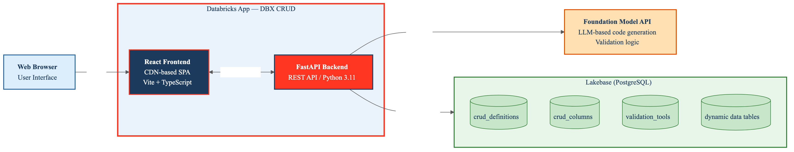
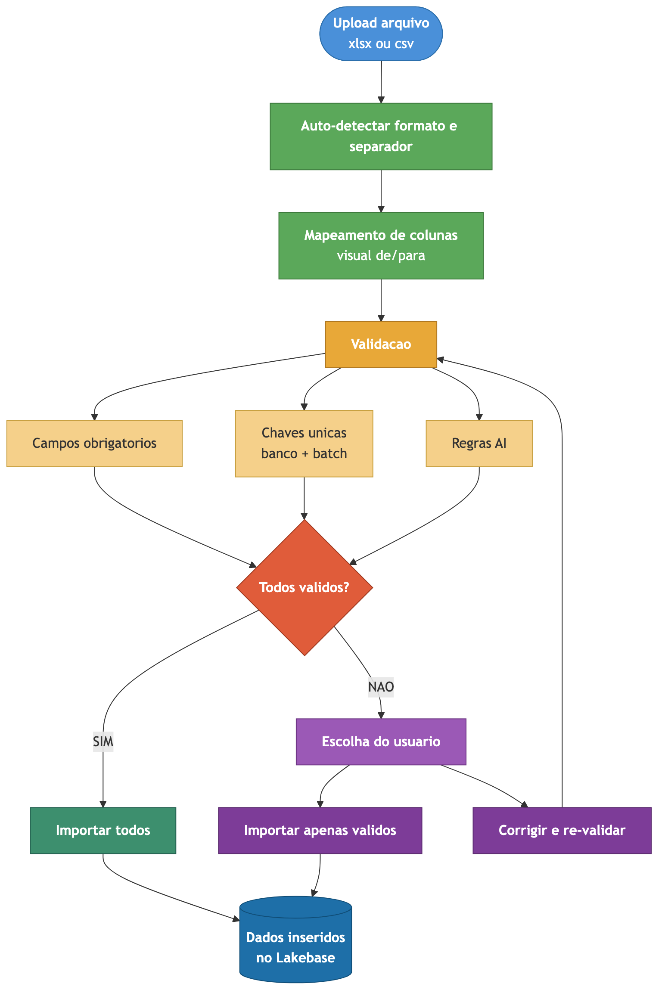
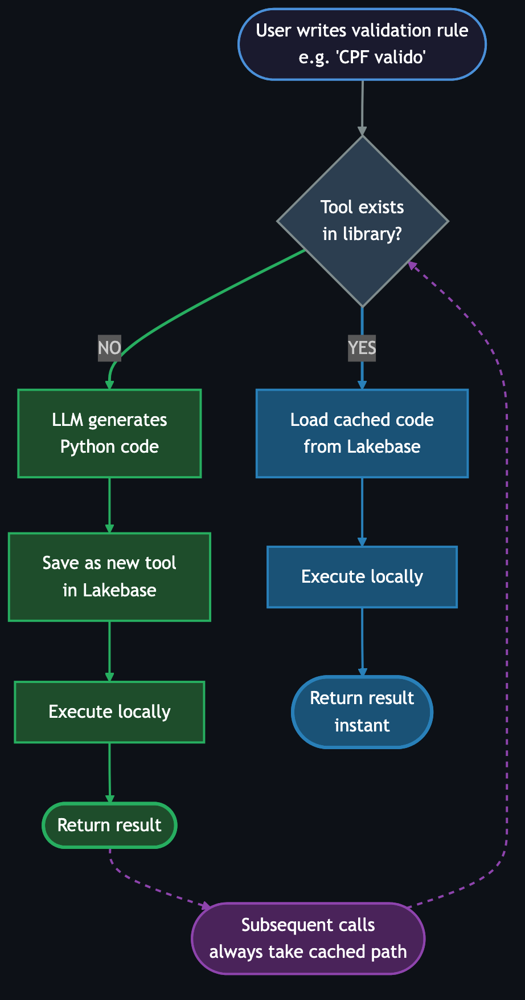

# Manual do Usuario - DBX CRUDs

> Crie tabelas, importe dados e valide com inteligencia artificial — tudo sem escrever uma linha de codigo.

---

## Sumario

1. [Visao Geral](#visao-geral)
2. [Arquitetura](#arquitetura)
3. [Painel Principal](#painel-principal)
4. [Criando uma Tabela](#criando-uma-tabela)
5. [Gerenciando Dados](#gerenciando-dados)
6. [Importando Dados (Excel/CSV)](#importando-dados)
7. [Validacao Inteligente com IA](#validacao-inteligente-com-ia)
8. [Biblioteca de Tools](#biblioteca-de-tools)
9. [Configuracoes](#configuracoes)
10. [Guia de Deploy](#guia-de-deploy)

---

## Visao Geral

O **DBX CRUDs** e uma aplicacao Databricks App que permite criar tabelas/formularios de forma visual, sem necessidade de SQL ou programacao. Ideal para equipes que usam Excel ou SharePoint e querem migrar para uma solucao estruturada com banco de dados.

### O que voce pode fazer

| Funcionalidade | Descricao |
|---|---|
| Criar tabelas | Defina colunas, tipos de dados, chaves unicas e regras de validacao |
| Importar dados | Upload de .xlsx e .csv com mapeamento visual e validacao pre-importacao |
| Validar com IA | Escreva regras em portugues (ex: "CPF valido") e a IA gera o validador |
| Buscar dados | Pesquisa inteligente em todos os campos |
| Exportar | Exporte qualquer tabela para Excel |
| Personalizar | Tema claro/escuro, cores, modelo de IA |

---

## Arquitetura



O sistema e composto por:

- **Frontend React** — Interface responsiva que roda no navegador, carregada via CDN (sem build necessario)
- **Backend FastAPI** — API REST em Python que gerencia tabelas, dados e validacoes
- **Lakebase (PostgreSQL)** — Banco de dados gerenciado pela Databricks onde os dados sao armazenados
- **Foundation Model API** — Modelos de IA (Claude, GPT, Llama, Gemini) usados para gerar codigo de validacao

### Banco de dados

```
┌─────────────────────────┐     ┌─────────────────────────┐
│   crud_definitions      │     │   crud_columns          │
│─────────────────────────│     │─────────────────────────│
│ id (PK)                 │◄────│ crud_id (FK)            │
│ name                    │     │ name / db_column        │
│ description             │     │ data_type               │
│ table_name              │     │ is_required             │
│ color                   │     │ is_unique               │
│ is_favorite             │     │ validation_rule         │
│ is_deleted              │     │ is_deleted              │
└─────────────────────────┘     └─────────────────────────┘

┌─────────────────────────┐     ┌─────────────────────────┐
│   crud_data_<nome>      │     │   validation_tools      │
│─────────────────────────│     │─────────────────────────│
│ _id (PK, BIGSERIAL)     │     │ keywords                │
│ <colunas dinamicas>     │     │ rule_example            │
│ _is_deleted             │     │ tool_name               │
│ _created_at             │     │ code (Python gerado)    │
│ _updated_at             │     │ usage_count             │
└─────────────────────────┘     └─────────────────────────┘
```

---

## Painel Principal

O painel e a tela inicial do app. Ele mostra:

- **Cards de estatisticas** — Total de tabelas, registros e colunas
- **Lista de tabelas** — Cards coloridos com nome, descricao, contagem de colunas/registros
- **Barra de busca** — Filtra tabelas por nome ou descricao
- **Favoritos** — Tabelas marcadas com estrela aparecem no topo e na barra lateral

### Acoes rapidas em cada card

| Botao | Acao |
|---|---|
| **Abrir** | Abre a tabela para ver/editar dados |
| **Editar** (lapis) | Edita nome, descricao, colunas |
| **Importar** (planilha) | Importa dados de Excel/CSV |
| **Excluir** (lixeira) | Exclusao logica (dados preservados) |
| **Estrela** | Marca/desmarca como favorito |

---

## Criando uma Tabela

A criacao segue um wizard de 3 etapas:

### Etapa 1: Informacoes basicas

- **Nome** — Nome da tabela (ex: "Clientes", "Produtos")
- **Descricao** — Texto opcional explicando o proposito
- **Cor** — 12 opcoes de cor para identificar visualmente

### Etapa 2: Definicao de colunas

Para cada coluna, defina:

| Campo | Descricao |
|---|---|
| **Nome** | Nome exibido na tela (pode ter espacos e acentos) |
| **Tipo** | Texto, Inteiro, Decimal, Sim/Nao, Data, Data/Hora |
| **Obrigatoria** | Se marcado, o campo nao pode ficar vazio |
| **Unica (UK)** | Chave unica — nao permite valores duplicados |
| **Regra AI** | Regra de validacao em linguagem natural |

#### Tipos de dados

| Tipo | No banco (Postgres) | Exemplo |
|---|---|---|
| Texto | TEXT | "Joao da Silva" |
| Inteiro | BIGINT | 42 |
| Decimal | NUMERIC(18,4) | 199.99 |
| Sim/Nao | BOOLEAN | true/false |
| Data | DATE | 2026-04-14 |
| Data/Hora | TIMESTAMP | 2026-04-14 10:30:00 |

#### Exemplos de regras AI

```
"deve ser um CPF valido com digito verificador"
"deve ser um CNPJ valido"
"deve ser um email com formato correto"
"deve conter apenas letras e espacos"
"deve ser um valor entre 0 e 100"
"deve ser uma data no futuro"
"deve ter no minimo 3 caracteres"
```

### Etapa 3: Revisao

Revise todas as informacoes antes de confirmar. Ao clicar "Criar Tabela", o sistema:

1. Cria o registro na tabela `crud_definitions`
2. Cria as colunas na tabela `crud_columns`
3. Cria uma tabela Postgres dinamica no Lakebase (ex: `crud_clientes`)
4. Aplica indices UNIQUE nas colunas marcadas

> **Nomes duplicados**: Se ja existir "Clientes", o sistema cria automaticamente "Clientes2", "Clientes3", etc.

---

## Gerenciando Dados

Ao abrir uma tabela, voce ve a tela de dados com:

### Barra de ferramentas

- **Busca** — Pesquisa em todos os campos simultaneamente
- **Adicionar** — Abre uma linha inline para preencher
- **Importar** — Vai para a tela de importacao
- **Exportar** — Baixa todos os dados como .xlsx
- **Editar** — Vai para a edicao da estrutura

### Tabela de dados

- **Selecao em lote** — Checkbox para selecionar multiplos registros
- **Ordenacao** — Clique no cabecalho de qualquer coluna para ordenar
- **Paginacao** — Navegacao por paginas (50 registros por pagina)
- **Edicao inline** — Clique no lapis para editar diretamente na tabela
- **Exclusao** — Individual ou em lote (exclusao logica)

### Validacao em tempo real

Se uma coluna tem regra AI, ao digitar um valor:
- **✓ Valido (verde)** — O valor atende a regra
- **✗ Mensagem de erro (vermelho)** — O valor nao atende
- **(cached)** — A validacao usou uma tool reutilizada

---

## Importando Dados



A importacao segue 4 etapas:

### Etapa 1: Upload

- Arraste ou selecione um arquivo **.xlsx** ou **.csv**
- CSV: o separador e detectado automaticamente (virgula, ponto-e-virgula, pipe, tab)

### Etapa 2: Mapeamento

- O sistema mostra as colunas do arquivo e as colunas da tabela lado a lado
- **Auto-mapear** tenta associar colunas por similaridade de nome
- Cada coluna da tabela tem um dropdown para selecionar a coluna correspondente do arquivo
- Colunas obrigatorias (*) e unicas (UK) sao indicadas visualmente

### Etapa 3: Validacao

Antes de importar, o sistema valida **todas as linhas**:

| Validacao | O que verifica |
|---|---|
| Campos obrigatorios | Se campos marcados como obrigatorios estao preenchidos |
| Chaves unicas | Se ha duplicatas no banco ou dentro do proprio arquivo |
| Regras AI | Executa as regras de validacao inteligente em cada valor |

O resultado mostra:

- **Cards resumo** — Total / Validos / Com erro
- **Tabela detalhada** — Status de cada linha com erros especificos por campo
- **Opcoes** — Importar todos OU importar apenas os validos

### Etapa 4: Importacao

Os dados sao inseridos no Lakebase. Ao final, um resumo mostra quantos foram importados e quantos tiveram erro.

---

## Validacao Inteligente com IA



### Como funciona

O DBX CRUDs usa uma abordagem inovadora de **code-generation** para validacoes:

1. **Voce escreve** a regra em portugues: `"deve ser um CPF valido"`
2. **A IA gera** codigo Python com o algoritmo de validacao completo
3. **O codigo executa** localmente com 100% de precisao
4. **O codigo e salvo** como uma "tool" reutilizavel

### Por que isso funciona

LLMs sao **otimos em escrever codigo** mas **pessimos em fazer contas de cabeca**. Em vez de pedir para a IA verificar se um CPF e valido (ela vai errar o digito verificador), pedimos para ela **escrever o programa** que verifica — e executamos o programa.

### Exemplo real

Para a regra "CPF valido com digito verificador", a IA gera algo como:

```python
import re

def validate(value: str) -> dict:
    digits = re.sub(r'\D', '', value)
    if len(digits) != 11:
        return {"valid": False, "message": "CPF deve ter 11 digitos"}
    
    # Calculo do primeiro digito verificador
    total = sum(int(digits[i]) * (10 - i) for i in range(9))
    d1 = 11 - (total % 11)
    d1 = 0 if d1 >= 10 else d1
    
    if int(digits[9]) != d1:
        return {"valid": False, "message": "Digito verificador invalido"}
    
    # Calculo do segundo digito verificador
    total = sum(int(digits[i]) * (11 - i) for i in range(10))
    d2 = 11 - (total % 11)
    d2 = 0 if d2 >= 10 else d2
    
    if int(digits[10]) != d2:
        return {"valid": False, "message": "Digito verificador invalido"}
    
    return {"valid": True}
```

Este codigo e executado instantaneamente para cada valor, sem chamar a IA novamente.

---

## Biblioteca de Tools

Toda validacao gerada pela IA e salva permanentemente no Lakebase como uma "tool". Isso significa:

| Cenario | O que acontece | Tempo |
|---|---|---|
| Primeira vez que alguem pede "CPF valido" | IA gera o codigo + salva como tool | ~1-2 segundos |
| Segunda vez (mesmo form ou outro) | Reutiliza o codigo salvo | Instantaneo |
| 2 meses depois, outro usuario pede "CPF valido" | Reutiliza o codigo salvo | Instantaneo |

### Vantagens

- **Zero custo** em validacoes reutilizadas (sem chamada de IA)
- **Consistencia** — Mesma regra sempre gera o mesmo resultado
- **Auto-crescimento** — A biblioteca cresce automaticamente conforme novos tipos de validacao sao solicitados
- **Visibilidade** — Em Configuracoes > Biblioteca de Validacoes, voce ve todas as tools, quantas vezes foram usadas, e quando foram criadas

---

## Configuracoes

### Modelo de IA

Escolha qual Foundation Model sera usado para gerar validacoes:

| Modelo | Descricao |
|---|---|
| databricks-llama-4-maverick | Padrao, bom custo-beneficio |
| databricks-claude-sonnet-4-6 | Alta qualidade de codigo |
| databricks-claude-opus-4-6 | Maximo raciocinio |
| databricks-gpt-5-4 | Alternativa OpenAI |
| databricks-gemini-3-1-pro | Alternativa Google |

### Tema

- **Claro** — Fundo branco, ideal para ambientes com luz
- **Escuro** — Fundo escuro, ideal para uso prolongado

### Cor de destaque

12 opcoes de cor que mudam o visual de botoes, links e elementos interativos do app.

### Biblioteca de Validacoes

Tabela mostrando todas as tools geradas automaticamente:

- **Tool name** — Identificador gerado a partir das keywords da regra
- **Regra exemplo** — A regra original que gerou a tool
- **Usos** — Quantas vezes a tool foi reutilizada
- **Criada em** — Data de criacao

---

## Guia de Deploy

### Pre-requisitos

- Workspace Databricks com Lakebase habilitado
- Databricks CLI >= 0.229.0

### Passo a passo rapido

```bash
# 1. Clone
git clone https://github.com/juliandrof/dbx-cruds.git
cd dbx-cruds

# 2. Autentique
databricks auth login --host https://SEU-WORKSPACE.cloud.databricks.com --profile dbx

# 3. Crie o app
databricks apps create dbx-cruds --description "Criador de tabelas" --profile dbx

# 4. Configure app.yaml com suas credenciais Lakebase

# 5. Upload + Deploy
databricks sync . /Users/SEU_EMAIL/dbx-cruds \
  --exclude node_modules --exclude .venv --exclude __pycache__ --exclude .git \
  --exclude "frontend/src" --exclude "frontend/public" --profile dbx

databricks apps deploy dbx-cruds \
  --source-code-path /Workspace/Users/SEU_EMAIL/dbx-cruds --profile dbx
```

> Para instrucoes detalhadas, consulte o [README.md](../README.md) na raiz do projeto.

---

## Suporte

- **Logs**: Acesse `https://SEU-APP-URL/logz`
- **API Docs**: Acesse `https://SEU-APP-URL/docs` (Swagger automatico do FastAPI)
- **Repositorio**: https://github.com/juliandrof/dbx-cruds
